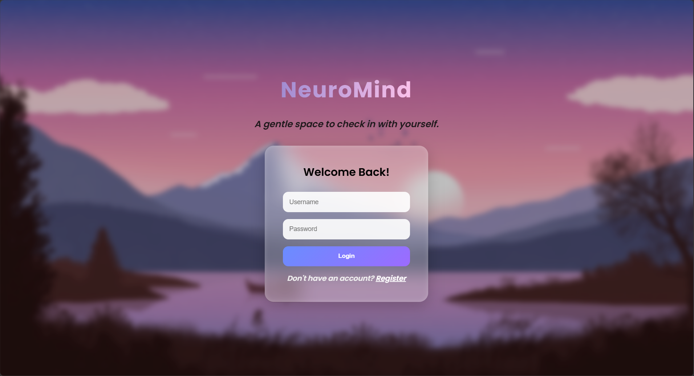
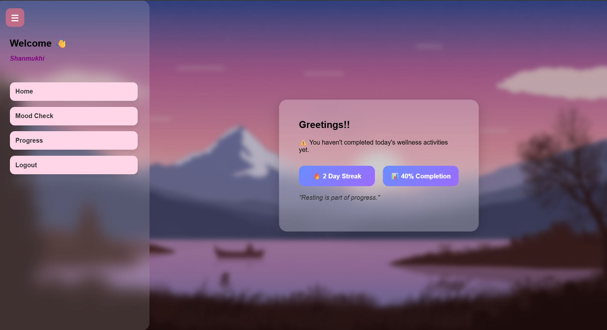
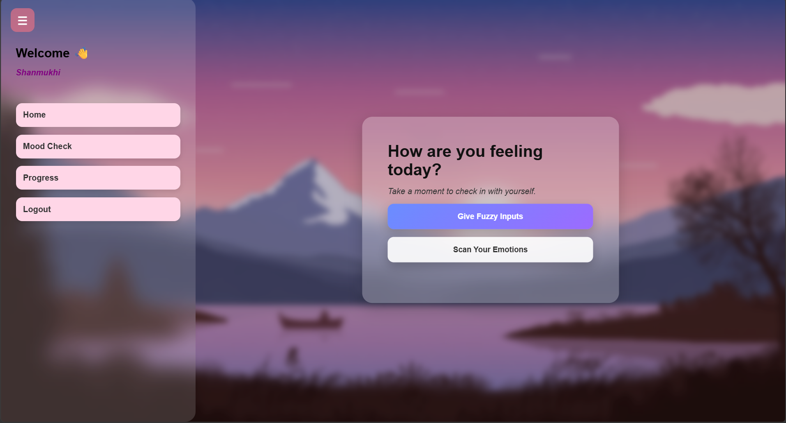
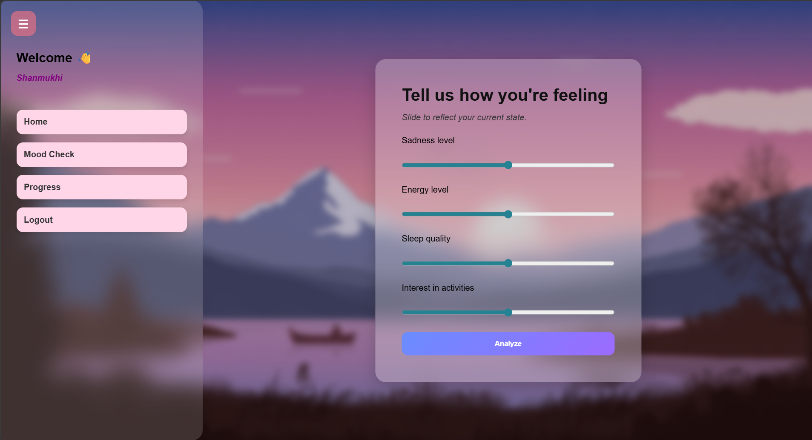
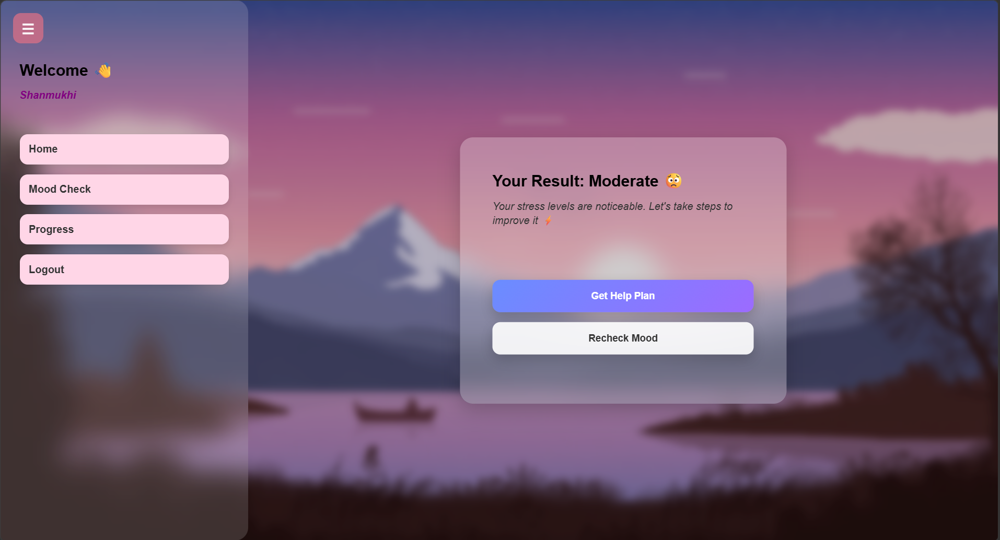
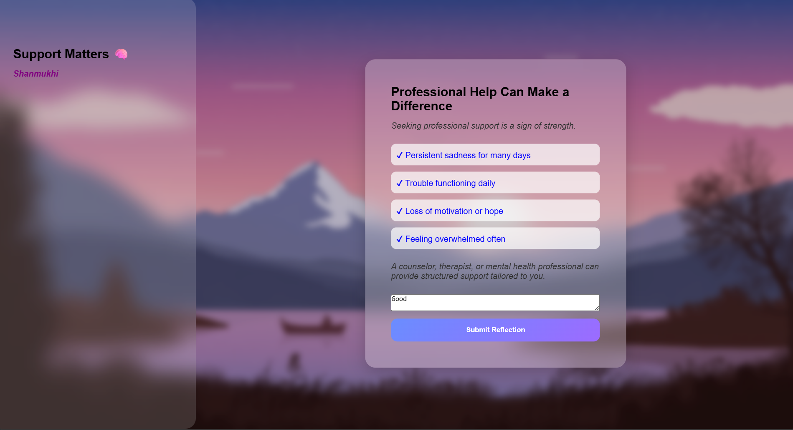
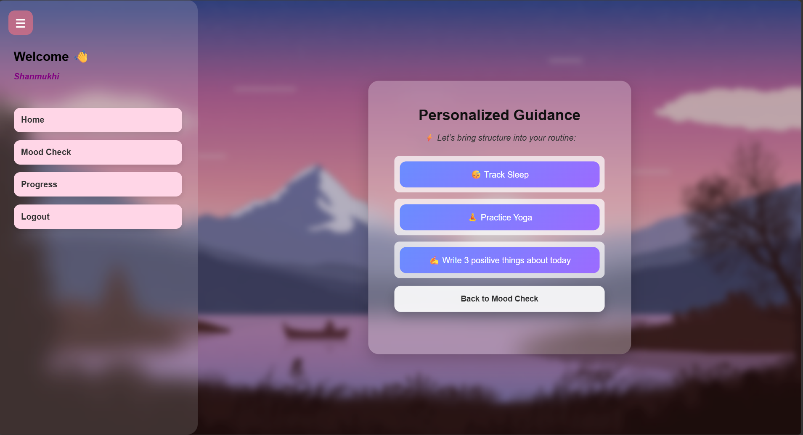
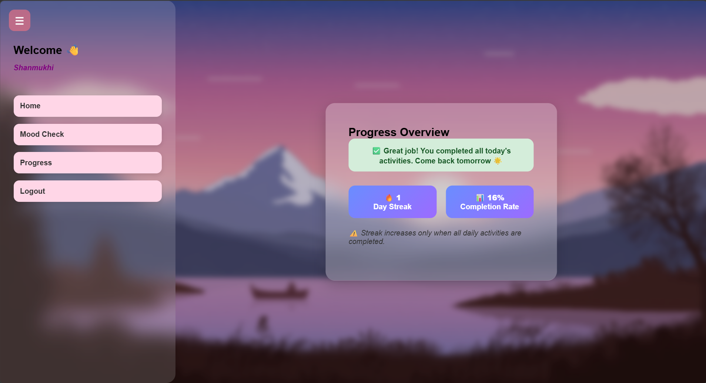

# NeuroMind 🧠

## Depression Detection System

NeuroMind is a web-based Depression Detection System developed to help assess an individual's depression level and provide personalized recommendations that may support mental well-being. The project aims to leverage technology to promote mental health awareness and encourage positive lifestyle habits.

## 📌 Overview

Mental health is an important aspect of overall well-being, yet many individuals hesitate to seek help or recognize early signs of depression. NeuroMind provides a simple and accessible platform where users can answer assessment questions and receive an evaluation of their depression level along with suitable activities and suggestions.

## ✨ Features

* User-friendly web interface
* Depression level assessment
* Personalized activity recommendations
* Secure user authentication
* Responsive design for different devices
* Fast and efficient result generation

## 🛠️ Technologies Used

### Frontend

* HTML5
* CSS3
* JavaScript

### Backend

* Python
* Flask

### Database

* SQLite (users.db)

## 🏗️ System Architecture

1. User registers or logs into the system.
2. User completes the depression assessment questionnaire.
3. The system processes the responses.
4. Depression severity level is determined.
5. Personalized activities and recommendations are generated.
6. Results are displayed to the user.

## 📂 Project Structure

```text
NeuroMind/
│
├── static/
│   ├── css/
│   ├── js/
│   └── images/
│
├── templates/
│
├── users.db
├── app.py
├── requirements.txt
└── README.md
```

## 🚀 Installation and Setup

### 1. Clone the Repository

```bash
git clone https://github.com/your-username/NeuroMind.git
```

### 2. Navigate to the Project Directory

```bash
cd NeuroMind
```

### 3. Create a Virtual Environment

```bash
python -m venv venv
```

### 4. Activate the Virtual Environment

Windows:

```bash
venv\Scripts\activate
```

Mac/Linux:

```bash
source venv/bin/activate
```

### 5. Install Dependencies

```bash
pip install -r requirements.txt
```

### 6. Run the Application

```bash
python app.py
```

### 7. Open in Browser

```text
https://neuromind.onrender.com
```

## 🎯 Objectives

* Promote mental health awareness
* Provide an accessible depression assessment tool
* Encourage positive coping strategies
* Demonstrate the application of web technologies in healthcare-related solutions

## 🔮 Future Enhancements

* Machine Learning-based depression prediction
* Real-time chatbot support
* Mood tracking dashboard
* Progress monitoring and analytics
* Email notifications and reminders
* Mobile application development

## 📸 Screenshots

### Login Page


### Dashboard


### Mood Check


### Mental States


### Depression Level Result


### Ongoing Activities


### Recommended Activities


### Progress Tracking


## 👩‍💻 Author

**Shanmukhi Vemula**

Integrated M.Tech (Software Engineering) Student
VIT-AP University

## 📄 License

This project is developed for educational and academic purposes.
